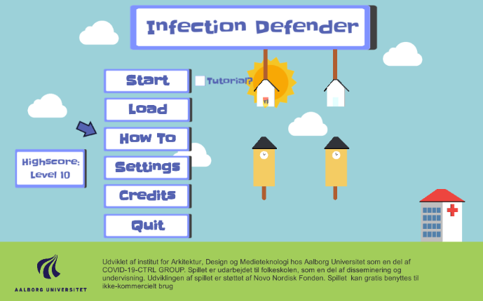
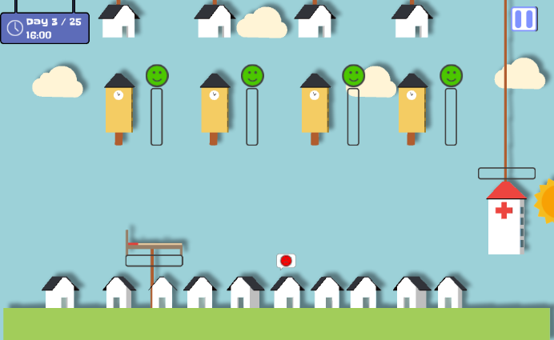
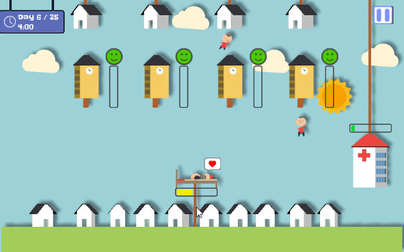
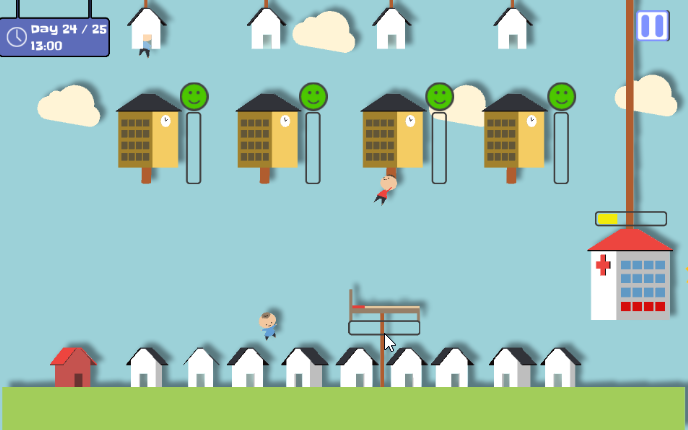
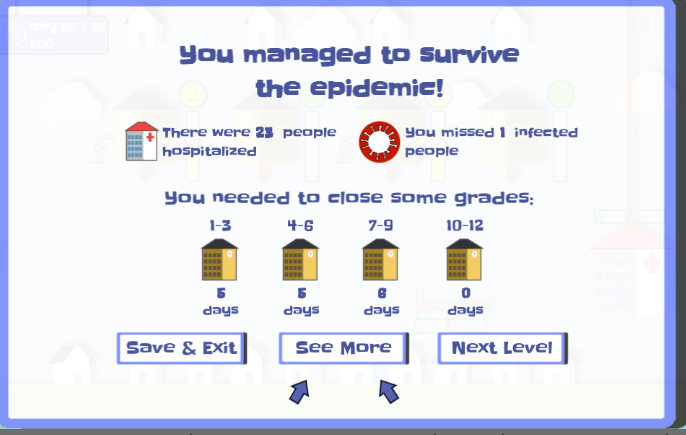
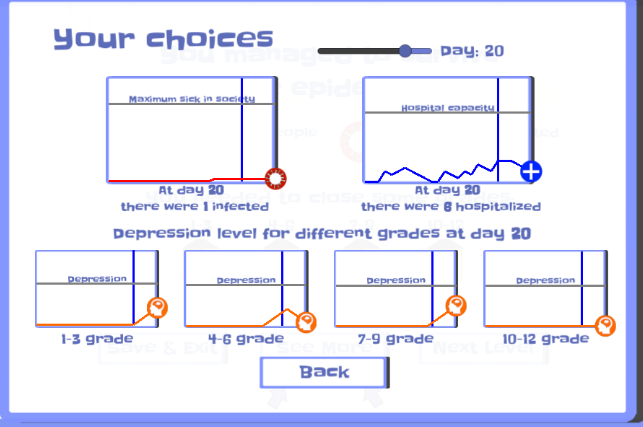

# Infection Defender - Children's Education Unity Game

A simple catcher style Unity WebGL educational game, made for explaining the government pandemic response of closing and opening schools for limiting infection spread. The game shows the balance between keeping people happy, keeping hospitals from overflowing and keeping infection spread in check.

The game is made for use in classrooms with the help of a teacher, as a reflective tool and contains a number visualization tools and graphs for providing feedback on the user's choices and their consequences. 

The game is still in development.


## Try Game
The game can be played directly on the [itch.io page ](https://ivanniko.itch.io/infection-defender-beta3h)
<!-- [Image Start Screen](docs/CONTRIBUTING.md)-->

## Getting Started
The repo contains the core Unity code for the Infection Defender game, with all used fonts, audio and model assets. For the appropriate licenses look at the License part of the readme. To get started, follow the instructions below:
1.  [Make sure you have all Requirements](## Requirements)
2.  [Download Source Code](## Installing)
3.  Run the project in Unity and Enjoy!


### Requirements
For getting started with the project you will need:

 - [Unity Game Engine ](https://unity3d.com/) 2019.3.7f1 or later
 - WebGL exporter installed, if you want to build it
 - Basic knowledge of Unity and C#
 - **Additionally**, install Visual Studio 2017 or newer or Visual Studio Code


### Installing
There are a number of ways to get started with the Unity project:

 - Clone the repo
```
git clone https://github.com/IvanNik17/InfectionGame.git
```
 - Download the newest release: LINK HERE

## Project Overview
The project  is divided into two main scenes:

 - Start Screen Scene


<!-- [Image Start Screen](docs/CONTRIBUTING.md)-->

 - Main Game Scene
 

<!-- [Image Start Screen](docs/CONTRIBUTING.md)-->

Code Structure:

 - Global Classes:
	 - **Global Timer** - keeps track of timers for the level, spawning and moving objects
	 - **Global Events** - initializations of all global events used in the project - spawning new kids, day passed, level completed, menu opening and closing, game start, stop, restart, etc.
	 - **Global Score Keeper** - keeps the scores for the current level for later saving and visualization at the end of the level - number of infected missed, number of infected hospitalized, happiness levels, etc.
	 - **Keep Data Between Levels** - a class of static methods and variables for keeping them between levels, as well as saving and loading PlayerPref variables between play sessions
 - Specialized Classes:
	 - **Spawn Kids** - contains methods for instantiating and keeping track of spawned "kids" objects
	 - **UI Interaction Visualize** - class containing all UI interactions, not connected to menus - visualizing and moving UI bars for the objects on screen
	 - **Game End Initializer** - keeps track of the different game end conditions - for winning and losing the the level
	 - **First Screen** - class keeping all the UI interactions and data for the start screen of the game. It keeps track of showing and hiding the sub screens like "How to Play", "Settings", "Credits", etc. As well as information loading and erasing when a new game is started or an old one is loaded.
	 - **Capture and Send Info** - specialized class for capturing information on the user's progress and decisions - this data is organized in a dictionary and can be saved to a file or uploaded to a database for post-game analysis of the users' performance and decisions. It is created as a way to user test the application. It logs only anonymized  game data. 
 - Game Object Worker Classes:
	 - **Spawner**- the classes is set to each of the spawner objects that create the kids objects. It keeps track of how many objects are created, from which "grade" they are, etc.
	 - **Kids** - the basic class for all kids objects containing pointers to where they are, are they infected or healthy, as well as a mover method
	 - **School Selector** - classes connected to each of the school game objects - it is used to open/close schools
	 - **Ambulance Mover** - script for moving the catcher objects with the mouse
	 - **Ambulance Trigger** - trigger objects to detect, when a infected object has been "coughed" by the user controlled catcher, as well as keeping a count of how many objects are in the catcher itself
	 - **Hospital Upload** - script that triggers hospitalization of infected objects to the hospital, as well as necessary visualizations
	 - **Society Counter** - a script that triggers when a missed infected object reaches society
	 - **School Trigger Counter** - script that triggers when a new object enters the school, it is used for counting amount of spawned objects and assigning them time for dropping down
 - UI Menu Worker Classes:
	 - **End Results Show** - class for visualizing and drawing the end UI screen showing an aggregation of the users actions
	 - **Start Screen** - class for the start UI screen
	 - **Pause Screen** - class for the pause UI screen and different button interactions
	 - **Health Bar** - UI bars for the hospital and the catcher object, keeping track of the amount of infected objects in each and visualizing.
	 - **Mental Bar** - UI bars for the happiness of kids, depending if the schools are close or not. Keep track of the amount of depression per school.
	 - **Change Text For Graph** - script for changing the UI text fields for the Graph screen
	 - **Draw Graph** - drawing a graph from the values captured for each level - the values are captured in lists - the visualized graphs are for infected in society each day, hospitalized each day and the happiness level for the different school grades per day
	 - **Rate Game** - a script for visualizing and keeping the game rating screen
	 - **Tutorial Script** - the class for visualizing the tutorial screen and going through the different explanation animations
## Screenshots
<!-- [Image Start Screen](docs/CONTRIBUTING.md)-->



<!-- [Image Start Screen](docs/CONTRIBUTING.md)-->



<!-- [Image Start Screen](docs/CONTRIBUTING.md)-->



<!-- [Image Start Screen](docs/CONTRIBUTING.md)-->




## Authors

 -   **Ivan Nikolov**  -  _Main Development_  -  [University PhD Profile](https://vbn.aau.dk/en/persons/136267)
 -  **Bastian Ilso**  -  _3D Art assets_  -  [University Profile](https://vbn.aau.dk/en/persons/137891)
 - Additional input and ideas:
	 - **Claus Madsen**
	 - **Thomas Moeslund**
	 - **Hendrik Knoche**
	 - **Martin Kraus**

<!-- See also the list of  [contributors](https://github.com/your/project/contributors)  who participated in this project. -->


## License

This project is licensed under the MIT License. Acknowledgement to [Aalborg University](https://www.en.aau.dk/) will also be greatly appreciated.

## Acknowledgments

-   Brackeys  [Unity Health Bar](https://youtu.be/BLfNP4Sc_iA)
-   Code Monkey [Building 2D graphs in Unity](https://youtu.be/CmU5-v-v1Qo)
